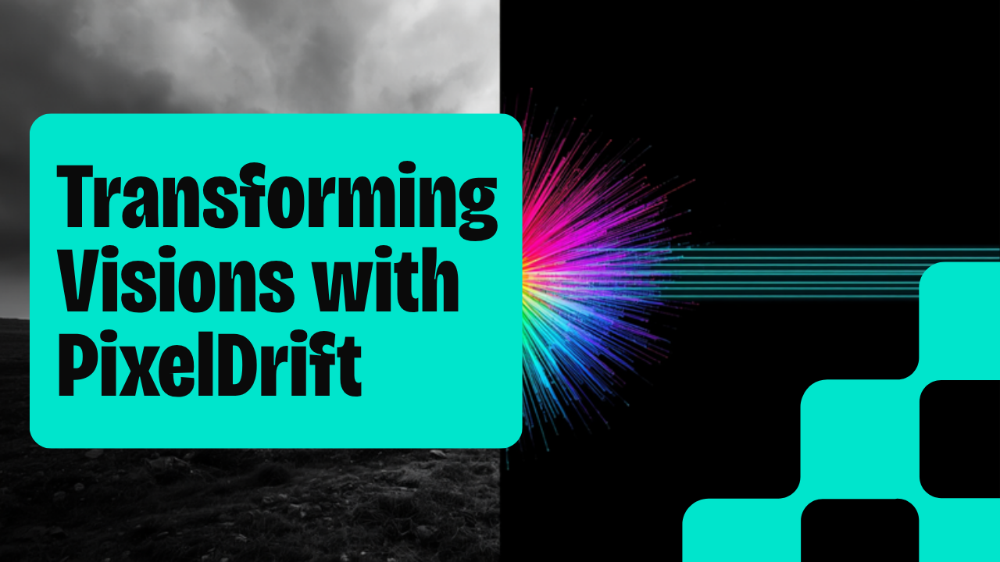

# PixelDrift



[](CHANGELOG.md)
[](https://github.com/mauryasameer/pixel-drift/actions)
[](https://www.python.org)
[](LICENSE)

CycleGAN-based unpaired grayscale image-to-image translation, built on
[meerax](https://github.com/mauryasameer/the-forge). Adds real checkpointing and a GenAI
translation-quality commentary layer via `meerax.llm`'s multimodal support, rendered into a
self-contained HTML report via `meerax.report`.

## Setup

```bash
pip install -r requirements.txt
```

Place two unpaired grayscale image domains in `src/data/domain_x` and `src/data/domain_y`
(gitignored — not included in this repo).

## Usage

```bash
python -m src.app --epochs 500 --llm-provider ollama
```

Flags:

| Flag | Default | Description |
|---|---|---|
| `--domain-x-dir` | `src/data/domain_x` | First image domain |
| `--domain-y-dir` | `src/data/domain_y` | Second image domain |
| `--image-size` | `256` | Square image size images are resized to; must be a multiple of 256 (the pix2pix U-Net downsamples 8x) |
| `--epochs` | `10` | Training epochs (notebook's original scale was 500) |
| `--checkpoint-dir` | `checkpoints` | Where to save/resume TensorFlow checkpoints |
| `--checkpoint-interval` | `5` | Save a checkpoint every N epochs |
| `--sample-interval` | `5` | Generate a sample grid + LLM commentary every N epochs |
| `--llm-provider` | `ollama` | Commentary backend: `ollama` / `claude` / `openai` |
| `--output` | `reports/model_report.html` | Report output path |

Output is a single HTML report with one section per sampled epoch: current losses
(generator/discriminator/cycle/identity), a translation sample grid, and an LLM-generated
qualitative description of translation quality.

Training auto-resumes from the latest checkpoint in `--checkpoint-dir` if one exists.

## Architecture

- `src/core/interfaces.py` — `GeneratorFactory` abstract interface
- `src/providers/pix2pix_factory.py` — `Pix2PixGeneratorFactory`, wraps `tensorflow_examples`
- `src/services/data_service.py` — domain loading and normalization
- `src/services/training_service.py` — `CycleGANTrainer`: training loop + checkpointing
- `src/services/narrative_service.py` — LLM vision commentary on sample grids
- `src/services/report_service.py` — HTML report assembly

## Docker

```bash
docker compose up --build
```

Training runs with this repo's own CLI defaults (`--epochs 10`); override via
`docker compose run pixel-drift python -m src.app --epochs 500 ...` for a longer real run, or a
smaller `--epochs`/`--sample-interval` for a quick smoke test. Set `ANTHROPIC_API_KEY` /
`OPENAI_API_KEY` in `.env` (copy from `.env.example`) if using `--llm-provider claude` /
`--llm-provider openai`; the default `ollama` provider expects Ollama running on the host.

## Governance

See [GOVERNANCE.md](./GOVERNANCE.md) for intended use, explainability boundaries, and LLM
controls.

## Testing

```bash
pytest tests/ -v
```

16 tests, zero real network/LLM/TensorFlow-training calls beyond tiny synthetic smoke tests
(one of which — `test_fit_with_real_factory_one_epoch`, marked `slow` — builds the real
`Pix2PixGeneratorFactory` U-Net for one full training step).
